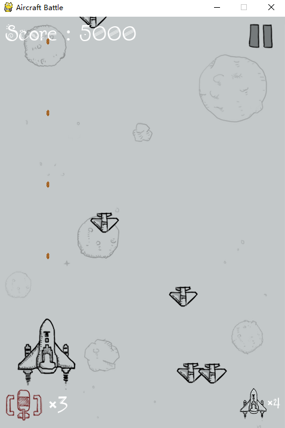

# AircraftBattle
A small game 'Aircraft Battle' coded by pygame. 
Run main.py and then you can play this small game.
The game interface is like this followed.

You will control your hero aircraft to fight with other enemies. Three kinds of enemies(small enemies, moderate enemies and large enemies).
The more size the enemy is, the more lives it has.
Watch out the subject only has 5 lives. Each colliding means lose one life. 0 lives means game over.
Along with time, this game wil be more and more diffcult. But don't worry, I give you two powerful weapons, one is double bullets and another is full screen bombs.
These weapons aren't infinite. You can get supply every 30 seconds.

一个基于pygame模块开发的飞机大战小游戏。
运行main.py，然后就可以玩这个小游戏了。
游戏界面如下。

你将控制你的英雄飞机与其他敌人。三种敌人(小敌人，中等敌人和大敌人)。
敌人的体型越大，它的生命就越多。
注意主角只有5条生命。每次碰撞都意味着失去一条生命。0条生命意味着游戏结束。
随着时间的推移，这个游戏会越来越难玩。
但是别担心，我给你两种强大的武器，一种是双倍子弹，另一种是全屏炸弹。
这些武器不是无限的。你每30秒就能得到补给。
